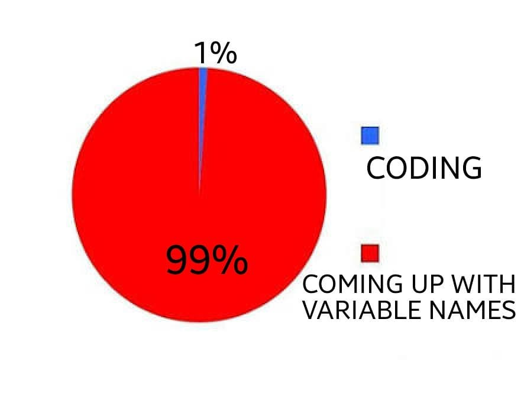

```{r setup, include=FALSE}
knitr::opts_chunk$set(echo = TRUE, 
                      eval = TRUE, 
                      message = FALSE, 
                      comment="", 
                      tidy=TRUE, 
                      warning = FALSE, 
                      fig.align = "center", 
                      out.width = "50%")

hook_output <- knitr::knit_hooks$get("output")
knitr::knit_hooks$set(output = function(x, options) {
if (!is.null(n <- options$out.lines)) {
x <- xfun::split_lines(x)
if (length(x) > n) {
# truncate the output
x <- c(head(x, n), "....\n")
} 
x <- paste(x, collapse = "\n")
} 
hook_output(x, options)
})
set.seed(9999)
library(knitr)
```

# Who aRe you?

##

- `R` is an open source software for statistical computing, graphics, and so much more

- `RStudio` is the perfect IDE for `R`  $\rightarrow$ allows for a better, easier use of `R` 

- `R` runs on Windows, MacOs, Unix

## CalculatoR

```{r eval = FALSE} 
3 + 2   # plus
3 - 2   # minus
3 * 2   # times
3 / 2   # divide
sqrt(4) # square root
log(3)  # natural logarithm
exp(3)  # exponential
```

Use brackets as you would do in a normal equation:

```{r eval = FALSE}
(3 * 2)/ sqrt(25 + 4) 
```

`R` ignores everything after # (it's a comment)

## Assign 

The results of the operations can be "stored" into objects with specific names defined by the users. 

To assign a value to an object, there are two operators: 

1. `=` `x = exp(2^2)`

2. `<-` `X <- log(2^2)`

The elements on the right are assigned to the object on the left 

\textcolor{red}{Careful!} `R` is case sensitive: `x` and `X` are two different objects!!!

## Variable names

```{r echo = FALSE, out.width="45%"}

```

Valid variable names are letters, numbers, dots, underscores (e. g.,
`variable_name`)

Variables names cannot start with numbers

Again, `R` is case sensitive


# Get help

## 

 `R` is open source and it used world wide $\rightarrow$ there's a huge community ready to help you

Just copy \& paste any error message or wanring in google or ask google "how to something in r"

 Ask `R` to help you! Type `?` in your console followed by the name of the function:

```{r eval = FALSE}
?mean()
```

Will show you the help page of the `mean()` function

# Be tidy

## Organize your files

`R` projects are the best way to organize your files (and your workflow)

It allows you to have all your files in a folder organized in sub folders 

You don't have to worry about the wording directories because it's all there!

By creating a nw project, you can also initialize a shiny app 

## Create a new `R` project

File $\rightarrow$ New project and choose what is best for you (unless you have already initialized a directory for your project, select a new directory): 

- `R` poject "basic"

- `R` package

- `Shiny`

and so much more


## Take out the trash

The `R` environment should be always tidy

If it feels like you're losing it, just clean it up: 

```{r eval = FALSE}
ls() # list objects in the envrinoment
rm(A) # remove object A from the environment
rm(list=ls()) # remove everything from the environment
```


## Save the environment

It might be useful to save all the computations you have done: 

```{r eval = FALSE}
save.image("my-computations.RData")
```
 
Then you can upload the enviroment back:

```{r eval=FALSE}
load("my-Computations.RData")
```

## When to save the environment

The computations are slow and you need them to be always and easily accessible 

The best practice wis to save the script and document it in an `RMarkdown` file 


# Working directories

## 

If you choose not to use the `R` projects (\small{what a bad, bad, bad idea}), you need to know your directories: 

```{r eval=FALSE}
getwd() # the working directory in which you are right now

dir() # list of what's inside the current working directory 
```

Change your working directory: 

```{r eval = FALSE}
setwd("C:/Users/huawei/OneDrive/Documenti/GitHub/RcouRse")
```


# Structures in `R`

## Functions and arguments (pt. I)

Almost everything in `R` is done with functions, consisting of: 

- a name: `mean`

- a pair of brackets: `()`

- some arguments: `na.rm = TRUE`

```{r}
mean(1:5, trim = 0, na.rm = TRUE)
```
Arguments may be set to default values; what they are is
documented in `?mean` 

## Functions and arguments (pt. II)

Arguments can be passed

- without name (in the defined order) 

- with name (in arbitrary order) $\rightarrow$ keyword matching

    mean(x, trim = 0.3, na.rm = TRUE)

No arguments? No problems, just brackets: 
    
    ls(), dir(), getwd()
    
Want to see the code of a function? Just type its name in the console without brackets: 

    mean

## Vectors

Vectors are created by **c**ombining together different objects

Vectors are created by using the `c()` function. 

All elements inside the `c()` function **must** be separated by a comma

Different types of objects $\rightarrow$ types of vectors: 

- `int`: numeric integers 
- `num`: numbers
- `logi`: logical
- `chr`: characters
- `factor`: factor with different levels


## `int` and `num`

`int`: refers to integer `r -3:3`

```{r}
v_int = c(1, 2, 3, 4, 5)
```

```{r echo = FALSE}
v_int
```


`num`: refers to all numbers from $-\infty$ to $\infty$ `r rnorm(6)`

```{r}
v_num = rnorm(6)
```

## `logi`

Logical values can be `TRUE` (`T`) or `FALSE` (`F`)

```{r}
v_logi = c(T, T, F, F, T)
```

```{r echo = FALSE}
v_logi
```


## `chr` and `factor`

`chr`: characters `r c(letters[1:3], LETTERS[4:6])`

```{r}
v_chr = c(letters[1:3], LETTERS[4:6])
```

```{r echo = FALSE}
v_chr 
```


`factor`: use numbers or characters to identify the variable levels

```{r}
v_fac = as.factor(c(rep(c("a", "b", "c"), each = 3)))
```

```{r echo = FALSE}
v_fac
```


## Don't mix them up \small unless you truly want to

`int` + `num` $\rightarrow$ `num` 

`int`/`num` + `logi` $\rightarrow$ `int`/`num` 

`int`/`num` + `factor` $\rightarrow$ `int`/`num` 

`int`/`num` + `chr` $\rightarrow$ `chr`

`chr` + `logi` $\rightarrow$ `chr`


## Vectors and operations

Vectors can be summed/subtracted/divided and multiplied with one another


```{r}
a = c(1:8)
a
b = c(4:1)
b 

a - b
```
If the vectors do not have the same length, you get a warning

## Vectors and operations PT. II

The function is applied to each value of the vector:

```{r}
sqrt(a)
```
The same operation can be applied to each element of the vector: 

```{r}
(a - mean(a))^2 # squared deviation
```


## Execersizes

- Open a new `R` script

- Create one vector for each type (`int`, `num`, `chr`, `logi`, `factor`) and assign each of them to an object

- Compute the mean of the  `int` and `num` vectors

- Standardize the values of the `int` and `num` vectors and store them in two new objects: 

$$ z = \frac{x_i - \bar{X}}{sd}$$

- Create a new vector by combining together the `logi` and `int` vectors

- Add the `logi` vector to the `num` vector

